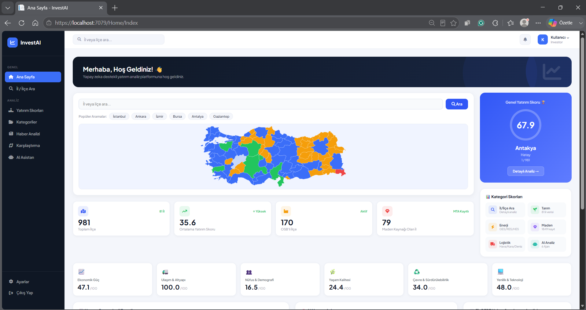
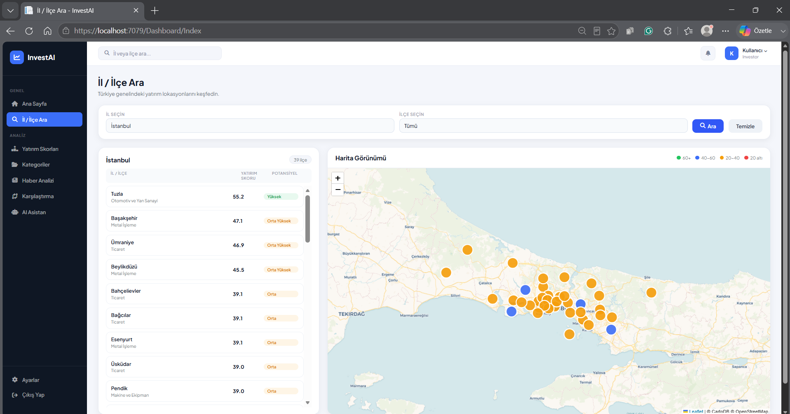
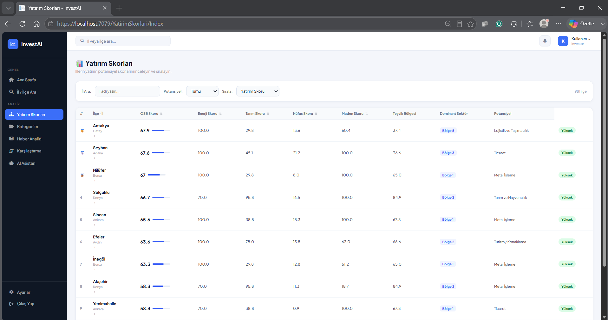
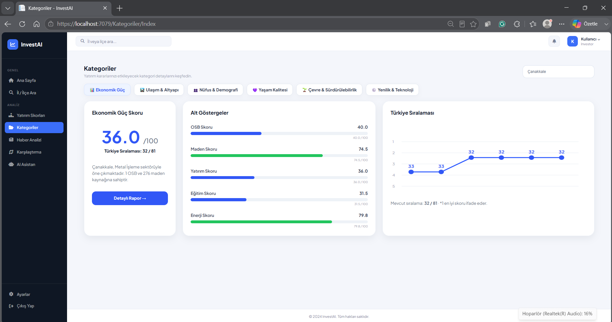
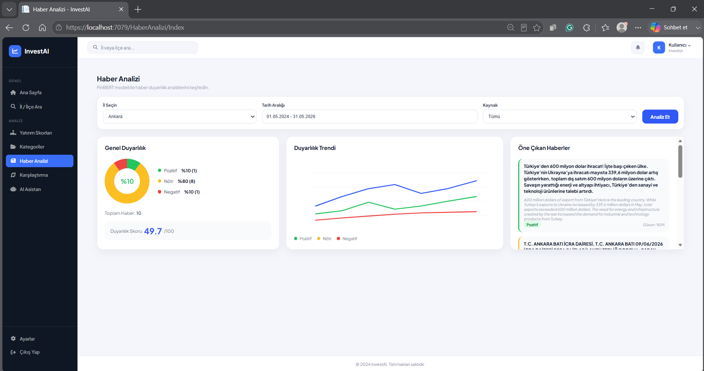
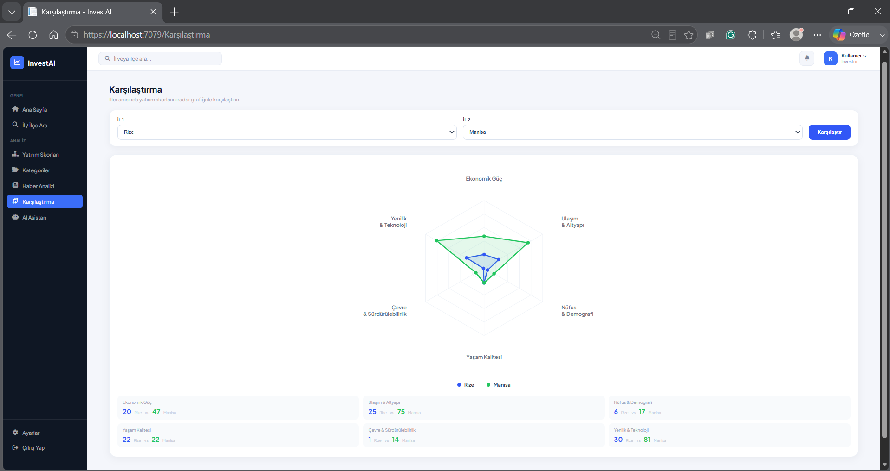
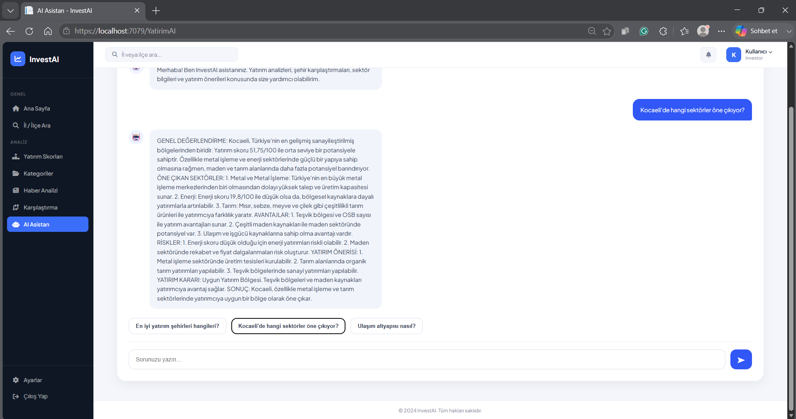

# InvestAI

## Regional Investment Analysis and Decision Support System

InvestAI is an artificial intelligence supported regional investment analysis platform developed as a graduation project. The system evaluates the investment potential of provinces and districts in Türkiye using statistical indicators, external data sources, multi-criteria decision making methods, and AI-powered analysis.

---

## Features

* Province and district based investment analysis
* Regional investment scoring system
* Artificial intelligence investment assistant
* Financial news sentiment analysis
* Infrastructure and transportation analysis
* Multi-criteria decision support
* Regional comparison module
* Interactive dashboards and visual analytics

---

## Technologies

### Backend

* ASP.NET Core MVC
* C#
* Entity Framework Core
* PostgreSQL

### Artificial Intelligence

* Ollama
* Llama 3.2
* FinBERT
* Natural Language Processing (NLP)

### Frontend

* Razor Views
* HTML
* CSS
* JavaScript
* Bootstrap

### External Data Sources

* TÜİK
* SGK
* MTA
* YEGM
* BOTAŞ
* World Bank API
* Google Maps API
* OpenWeather API

---

# System Screenshots

## Dashboard

---

## Project Scope

InvestAI covers all 81 provinces of Türkiye and supports province-level and district-level investment analysis. The platform combines structured regional data with artificial intelligence models to generate investment insights and recommendations.

---

## Developer

**Ceren Çokgezer**

Software Development Graduation Project

Yeditepe University
